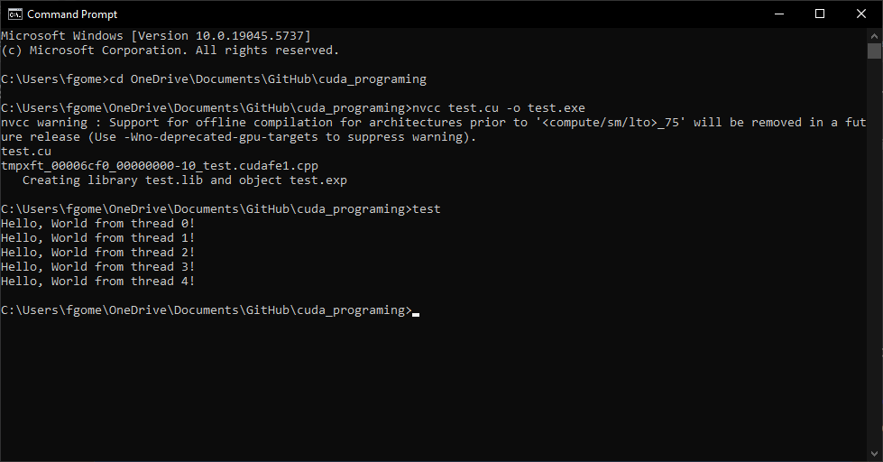
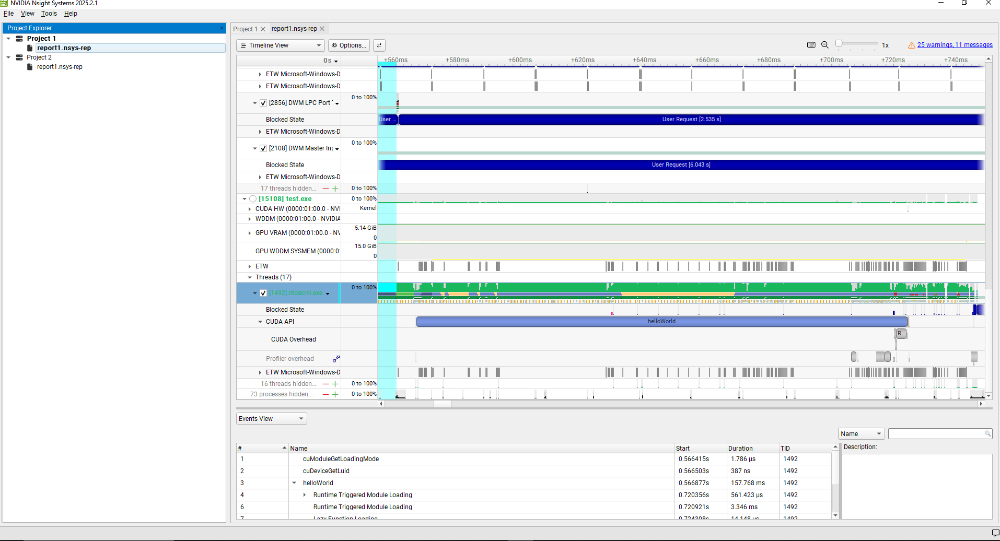

# CUDA Hello World Experiment

This repository documents my experiment with CUDA programming, where I wrote a simple "Hello World" program to run on the GPU, compiled it using Visual Studio Code (VS Code), and analyzed the execution using NVIDIA Nsight. The experiment was conducted on a Windows 10 system with an NVIDIA GTX 1060 GPU (compute capability 6.1). Below is a step-by-step guide of the process, including setup, compilation, and profiling.

## System Specifications

- **Operating System**: Windows 10
- **GPU**: NVIDIA GTX 1060 6GB (Compute Capability 6.1)
- **Driver Version**: 572.61 (Supports CUDA 12.8)
- **CUDA Toolkit**: 12.4
- **Visual Studio**: 2022 Community (MSVC 14.43.34809)
- **IDE**: Visual Studio Code (VS Code)
- **Profiling Tool**: NVIDIA Nsight Systems

## Prerequisites

Before starting, ensure you have the following installed:
- NVIDIA GPU with CUDA support (check with `nvidia-smi`).
- Visual Studio 2022 Community with the "Desktop development with C++" workload.
- Visual Studio Code for editing CUDA code.

## Step 1: Install CUDA Toolkit

1. **Download CUDA Toolkit**:
   - I downloaded CUDA Toolkit 12.4 from the NVIDIA CUDA Toolkit Archive.
   - URL: https://developer.nvidia.com/cuda-downloads

2. **Install CUDA Toolkit**:
   - Ran the installer and selected the default installation path: `C:\Program Files\NVIDIA GPU Computing Toolkit\CUDA\v12.4`.
   - Ensured the Visual Studio integration was selected (for compatibility with Visual Studio 2022).

3. **Verify Installation**:
   - Checked the CUDA version using:
     ```
     nvcc --version
     ```
   - Expected output:
     ```
     nvcc: NVIDIA (R) Cuda compiler driver
     Copyright (c) 2005-2023 NVIDIA Corporation
     Built on ...
     Cuda compilation tools, release 12.4, ...
     ```

## Step 2: Install NVIDIA Nsight Systems

1. **Download Nsight Systems**:
   - Obtained NVIDIA Nsight Systems from the NVIDIA Developer website.
   - URL: https://developer.nvidia.com/nsight-systems

2. **Install Nsight Systems**:
   - Installed Nsight Systems, ensuring it was compatible with CUDA 12.4 and my GTX 1060.
   - Default installation path: `C:\Program Files\NVIDIA Corporation\Nsight Systems`.

3. **Verify Installation**:
   - Launched Nsight Systems from the Start menu to confirm it opens without errors.

## Step 3: Set Up Environment Variables

To ensure `nvcc` (CUDA compiler) and `cl.exe` (MSVC compiler) are accessible across shells (cmd, Windows PowerShell, PowerShell 7), I configured the PATH environment variables.

### User PATH Configuration

1. **Clean Existing PATH**:
   - Removed any outdated CUDA and MSVC paths using PowerShell. In my case I had old ones:
     ```
     $currentPath = [Environment]::GetEnvironmentVariable("PATH", "User")
     $paths = $currentPath -split ";" | Where-Object { $_ -notmatch "CUDA\\v11.8|CUDA\\v12.8|MSVC\\14.29" }
     $newPath = $paths -join ";"
     [Environment]::SetEnvironmentVariable("PATH", $newPath, "User")
     ```

2. **Add CUDA and MSVC Paths**:
   - Added the CUDA 12.4 and MSVC 14.43.34809 paths. A fresh installation of CUDA and MSVC takes care of this:
     ```
     $currentPath = [Environment]::GetEnvironmentVariable("PATH", "User")
     $cudaPath = "C:\Program Files\NVIDIA GPU Computing Toolkit\CUDA\v12.4\bin"
     $msvcPath = "C:\Program Files\Microsoft Visual Studio\2022\Community\VC\Tools\MSVC\14.43.34809\bin\HostX64\x64"
     $newPath = "$msvcPath;$cudaPath;" + ($paths -join ";")
     [Environment]::SetEnvironmentVariable("PATH", $newPath, "User")
     ```

3. **Set CUDA_PATH**:
   - Configured the `CUDA_PATH` variable, but like I said, fresh installs take care of this:
     ```
     [Environment]::SetEnvironmentVariable("CUDA_PATH", "C:\Program Files\NVIDIA GPU Computing Toolkit\CUDA\v12.4", "User")
     ```

4. **Update Shell Profiles**:
   - **PowerShell 7 Profile** (`$PROFILE`). I did this because I run PS7 on my PC <> Windows Powershell:
     ```
     $env:PATH = $env:PATH + ";C:\Program Files\NVIDIA GPU Computing Toolkit\CUDA\v12.4\bin;C:\Program Files\Microsoft Visual Studio\2022\Community\VC\Tools\MSVC\14.43.34809\bin\HostX64\x64"
     $env:CUDA_PATH = "C:\Program Files\NVIDIA GPU Computing Toolkit\CUDA\v12.4"
     ```
   - **Windows PowerShell Profile** (`$PROFILE`):
     ```
     $env:PATH = $env:PATH + ";C:\Program Files\NVIDIA GPU Computing Toolkit\CUDA\v12.4\bin;C:\Program Files\Microsoft Visual Studio\2022\Community\VC\Tools\MSVC\14.43.34809\bin\HostX64\x64"
     $env:CUDA_PATH = "C:\Program Files\NVIDIA GPU Computing Toolkit\CUDA\v12.4"
     ```

5. **Verify PATH**:
   - In PowerShell:
     ```
     $env:PATH -split ";" | Select-String "CUDA|MSVC"
     ```
   - In cmd:
     ```
     echo %PATH% | findstr /I "CUDA MSVC"
     ```

## Step 4: Write the CUDA Code

I created a simple CUDA program (`test.cu`) to print "Hello, world" from 5 GPU threads. The code is stored in the repository at `CUDA/test.cu`.

### Code: `test.cu`

```cpp
// The following include brings in the standard C++ library that helps us with input/output (e.g., printing messages)
#include <iostream>

// This header file is needed for CUDA-specific functionality, like launching kernels (GPU functions) and using GPU resources.
#include <cuda_runtime.h>

// This is the **CUDA kernel**. CUDA code runs on the GPU. Any function declared with `__global__` is a CUDA kernel.
// `__global__` tells the compiler that this function should run on the GPU, not the CPU.
__global__ void helloWorld() {
    // This line uses the `printf` function to print a message from the GPU.
    // `threadIdx.x` is a special variable in CUDA that gives each thread its unique ID within a block.
    // In this case, each thread prints its own ID (0, 1, 2, 3, etc.).
    printf("Hello, world from thread %d!\n", threadIdx.x);
}

// This is the **main** that runs on the **CPU** (not the GPU).
int main() {
    // Here, we're launching the kernel (GPU function) we defined earlier.
    // `helloWorld<<<1, 5>>>();` launches the kernel with 1 block of 5 threads.
    // In CUDA, you define the number of blocks and threads for your kernel execution.
    // `<<<1, 5>>>` means 1 block with 5 threads. Each thread runs `helloWorld`.
    helloWorld<<<1, 5>>>();

    // `cudaDeviceSynchronize()` makes sure that the CPU waits until all threads on the GPU have finished.
    // Without this line, the CPU might finish running the program before the GPU is done printing messages.
    // This is important because the GPU runs in parallel, and we need to synchronize the CPU and GPU.
    cudaDeviceSynchronize();

    // The program ends here, returning 0 to indicate that everything ran successfully.
    return 0;
}
```

## Step 5: Compile the CUDA Code

1. **Navigate to Directory**:
   - In PowerShell or cmd:
     ```
     cd C:\Users\fgome\OneDrive\Documents\GitHub\<repository-name>\CUDA
     ```

2. **Compile the Code**:
   - Used the following command to compile `test.cu` for the GTX 1060:
     ```
     nvcc test.cu -o test.exe -arch=sm_61
     ```
   - The `-arch=sm_61` flag specifies the compute capability of the GTX 1060.

3. **Verify Compilation**:
   - Checked for the output executable:
     ```
     dir test.exe
     ```

4. **Run the Program**:
   - Executed the compiled program:
     ```
     ./test.exe
     ```
   - Output:
     ```
     Hello, world from thread 0!
     Hello, world from thread 1!
     Hello, world from thread 2!
     Hello, world from thread 3!
     Hello, world from thread 4!
     ```

## Step 6: Analyze with NVIDIA Nsight

1. **Profile the Program**:
   - Launched Nsight Systems and created a new project.
   - Configured the project to profile `test.exe`.
   - Ran the profiling session to capture GPU execution details.

2. **Findings**:
   - The timeline showed the `helloWorld` kernel execution with 1 block and 5 threads.
   - Kernel duration: 1.786 µs.
   - Observed CUDA API calls (e.g., `cudaDeviceGetLimit`, `helloWorld` kernel launch) and memory usage.

3. **Screenshot of Nsight Timeline**:



## Key Takeaways

- **Environment Setup**: Properly configuring PATH variables for `nvcc` and `cl.exe` across shells is critical. Use `-ccbin` to specify the MSVC path if compilation fails.
- **CUDA Basics**: The `test.cu` program demonstrates core CUDA concepts: launching a kernel (`__global__`), managing threads (`threadIdx.x`), and CPU-GPU synchronization (`cudaDeviceSynchronize()`).
- **Profiling**: Nsight Systems provides a detailed view of GPU execution, showing thread activity, API calls, and performance metrics, which is essential for understanding CUDA programs.

## Conclusion

This experiment served as an introduction to CUDA programming, from installation and setup to writing, compiling, and profiling a simple GPU program. The process highlighted the importance of environment configuration and the power of profiling tools like Nsight for understanding GPU behavior.
